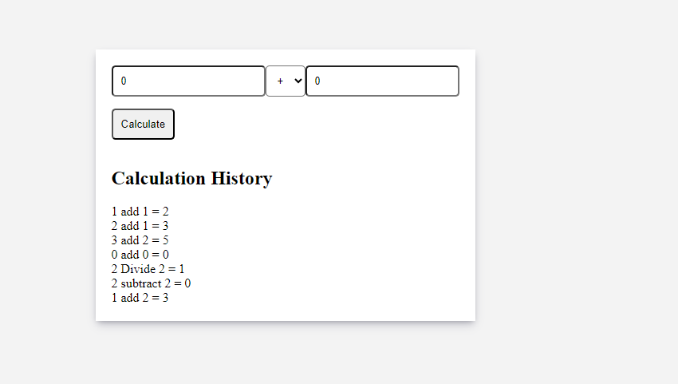

# Calculator Application

This is a full-stack calculator application that allows users to perform basic math operations such as addition, subtraction, multiplication, and division. The application provides a user-friendly interface for inputting numbers and selecting operations, and it displays the results of the calculations. The backend is built using C#, .NET Core, and SQL Server for data storage, while the frontend is developed using Angular.

## Installation and Setup

### Frontend (Angular)

1. Clone the repository: `git clone <repository_url>`
2. Navigate to the frontend directory: `cd angularapp`
3. Install dependencies: `npm install`
4. Start the development server: `ng serve`

### Backend (.NET Core)

1. Navigate to the backend directory: `cd webapi`
2. Configure the database connection string in the appsettings.json file.
3. Run the .NET Core application: `dotnet run`

## Usage

1. Access the application in your web browser using the specified URL.
2. Input two numbers and select the desired operation from the user interface.
3. View the calculated result on the screen and the history of calculations.

## Screenshots

## Testing

The backend components contain unit tests.

## Technologies Used
1. Angular
2. C#
3. .NET Core
4. SQL Server
5. Entity Framework Core
6. HTML
7. CSS
8. TypeScript

